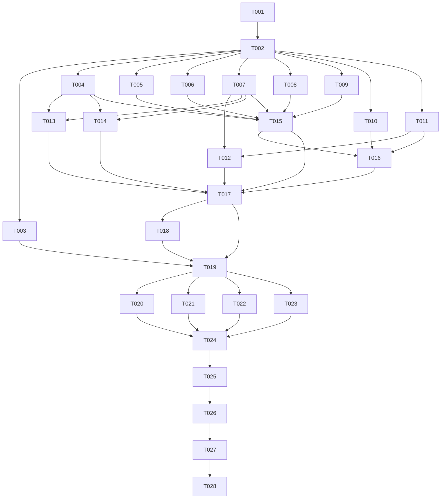

# xDownload v0.1.0 — Task DAG

Status: **CANDIDATE / NOT FROZEN**  
Planning review policy: **`review:required`**  
Product release target: `v0.1.0`  
Version branch: `version/v0.1.0`  
Exact planning baseline: `b3a2f440d29d662e527ca232d340530309866fc9`  
Baseline tree: `617868ce2ae2002d03469c5d82372f5d6eae5945`

## Frozen authority

- Product/Scope: `docs/planning/STAGE1_PRODUCT_SCOPE_FREEZE.md` → Frozen PRD `docs/product/PRD-v0.4.2-review-candidate.md`.
- Architecture: `docs/planning/STAGE2_ARCHITECTURE_FREEZE.md` → Frozen L2 `docs/architecture/L2_ARCHITECTURE_EVIDENCE.md` blob `5f6865974a4f2dbe78062c26e66d6a24af43d4a7`.
- Architecture Freeze authority: Issue #13 comment `5956778895`.
- ADS: `4.0.0@94cad2b0487e8a552c66d6bcd1cba36b7779383d`.
- Frozen Product/L2 outrank this planning DAG. Any contradiction routes upward; this file cannot redesign them.

This candidate deliberately separates Task/PR gates from version Validation, Candidate Freeze, Hidden Validation, Version Closure and Release Qualification. No Validation PASS is claimed here.

## Readable DAG

## Task table

| ID | Task | Dependencies | Owned boundary | Review | Risk | L3 | Preferred executor |
|---|---|---|---|---|---|---|---|
| T001 | Repository/toolchain bootstrap + CI activation | — | repository/toolchain/bootstrap and CI profile | `required` | `high` | `required` | Local Builder on real build host + strong-model guidance |
| T002 | Canonical domain contracts, schemas and semantic kernel | T001 | public/domain contracts | `required` | `critical` | `required` | High-capability Builder + executable contract tests |
| T003 | Validation harness, corpora and gate instrumentation | T002 | version validation infrastructure | `required` | `high` | `required` | Local validation-engineering Builder |
| T004 | Core command/query authority boundary | T002 | Core runtime control boundary | `required` | `high` | `required` | Local Builder + strong security/contract support |
| T005 | SQLite persistence, durable ledger and recovery | T002 | persistence/data integrity/recovery | `required` | `critical` | `required` | Local Builder on real SQLite/filesystem host |
| T006 | Scheduler, lifecycle budgets, cancellation and retry | T002 | scheduler/concurrency/control ordering | `required` | `critical` | `required` | High-capability local Builder |
| T007 | Typed Evidence, Validation, Coverage and Result projection | T002 | truth/evidence/result semantics | `required` | `high` | `required` | High-capability Builder |
| T008 | Direct HTTP/file acquisition + resume/retry/integrity | T002 | S1/S3 direct acquisition | `required` | `high` | `required` | Local protocol Builder |
| T009 | HLS VOD media adapter | T002 | S4 media/protocol execution | `required` | `high` | `required` | Local Builder with media tooling |
| T010 | Browser observation, Native Messaging broker and scoped authorization | T002 | browser/security/auth boundary | `required` | `critical` | `required` | Local Builder with real Chromium/native host |
| T011 | Recipe/discovery engine + bounded collection semantics | T002 | deterministic discovery/S5-S6/HITL | `required` | `high` | `required` | High-capability Builder |
| T012 | Bounded AI proposal adapter | T007, T011 | AI proposal/redaction boundary | `required` | `high` | `required` | Strong-model/local Builder pair |
| T013 | CLI adapter | T004, T007 | CLI surface | `recommended` | `medium` | `recommended` | Local Builder |
| T014 | Desktop UI adapter | T004, T007 | Desktop presentation surface | `recommended` | `medium` | `recommended` | Local Builder with desktop runtime |
| T015 | Authoritative Core runtime integration | T004, T005, T006, T007, T008, T009 | Core integration | `required` | `critical` | `required` | High-capability local integration Builder |
| T016 | Browser + collection workflow integration | T010, T011, T015 | S2/S5/S6 integration | `required` | `critical` | `required` | High-capability local Builder with browser access |
| T017 | Surface + AI convergence integration | T012, T013, T014, T015, T016 | Desktop/CLI/AI convergence | `required` | `high` | `required` | High-capability integration Builder |
| T018 | Packaging and platform integration | T017 | build/package/native-host integration | `required` | `high` | `required` | Local Builder on selected real platform host(s) |
| T019 | Version candidate preparation + visible regression convergence | T003, T017, T018 | version integration/candidate stabilization | `required` | `critical` | `required` | High-capability integration Builder/Controller |
| T020 | Core crash/restart/data-integrity Validation | T019 | exact-candidate core validation | `not-required` | `critical` | `not-required` | Independent real-host Validator |
| T021 | Browser/auth/security real-host Validation | T019 | exact-candidate browser/security validation | `not-required` | `critical` | `not-required` | Independent Browser/Platform Validator |
| T022 | Product gates + Critical Journey Validation | T019 | exact-candidate product/CJ validation | `not-required` | `critical` | `not-required` | Independent product Validator |
| T023 | Package/platform qualification Validation | T019 | exact-candidate package/platform validation | `not-required` | `high` | `not-required` | Independent Platform Validator |
| T024 | Candidate Freeze gate | T020, T021, T022, T023 | candidate freeze authority | `not-required` | `critical` | `not-required` | High-capability ChatGPT Web/Controller |
| T025 | Hidden Validation | T024 | post-freeze hidden validation | `not-required` | `critical` | `not-required` | Independent Hidden Validator |
| T026 | Version Closure | T025 | version closure authority | `not-required` | `critical` | `not-required` | High-capability Closure Controller |
| T027 | Release Qualification | T026 | release qualification authority | `not-required` | `critical` | `not-required` | High-capability Release Controller |
| T028 | Version PR + release baseline integration | T027 | repository integration/release baseline | `required` | `high` | `not-required` | High-capability Repository Integration Controller |

All implementation Task Packs use the intended merge target `version/v0.1.0`; branches are JIT and are **not** created by this planning checkpoint.

## Exact dependency list and why each edge is real

- **T001** ← `NONE` — bootstrap root; implementation cannot truthfully run before toolchain/CI exists.
- **T002** ← `T001` — canonical executable schemas/tests require the established workspace/toolchain.
- **T003** ← `T002` — validation corpora/oracles must bind Frozen canonical identities and result semantics.
- **T004** ← `T002` — command/query implementation must consume the canonical contract/DTO authority.
- **T005** ← `T002` — schema/migrations/ledger persist canonical identities and cannot pre-invent them.
- **T006** ← `T002` — scheduler/budget/cancel state machine consumes canonical lifecycle identities and invariants.
- **T007** ← `T002` — evidence/result projection implements canonical schemas and status rules.
- **T008** ← `T002` — transfer adapter consumes canonical target/effect/budget/evidence ports.
- **T009** ← `T002` — HLS adapter consumes canonical target/effect/budget/validation ports.
- **T010** ← `T002` — browser/auth binding must use exact canonical contract/snapshot/target/provenance identities.
- **T011** ← `T002` — Recipe/discovery/collection scope engine must consume immutable scope/snapshot semantics.
- **T012** ← `T007,T011` — AI proposals are subordinate to Recipe policy and typed evidence/result authority.
- **T013** ← `T004,T007` — CLI is a thin client of command/query and canonical result projections.
- **T014** ← `T004,T007` — Desktop UI is a thin client of command/query and canonical result projections.
- **T015** ← `T004,T005,T006,T007,T008,T009` — authoritative Core convergence requires all mutable-state/control/truth/direct-media lanes.
- **T016** ← `T010,T011,T015` — S2/S5/S6 must bind browser/auth and collection discovery to the integrated Core.
- **T017** ← `T012,T013,T014,T015,T016` — full surfaces/AI converge only after Core/browser/collection and each thin adapter exist.
- **T018** ← `T017` — packaging must package the actual integrated product and native browser seam, not placeholders.
- **T019** ← `T003,T017,T018` — candidate stabilization needs full implementation, reusable validation harness and production package path.
- **T020** ← `T019` — exact-candidate recovery/data-integrity Validation cannot run before candidate identity stabilizes.
- **T021** ← `T019` — exact-candidate real-browser/security Validation requires the stabilized integrated subject.
- **T022** ← `T019` — Critical Journeys/G0/G1 must run on the stabilized exact product candidate.
- **T023** ← `T019` — package/platform qualification must bind the same exact candidate and actual package artifacts.
- **T024** ← `T020,T021,T022,T023` — Candidate Freeze requires all mandatory visible gates on one exact SHA.
- **T025** ← `T024` — Hidden Validation executes only after Candidate Freeze.
- **T026** ← `T025` — Version Closure checks visible Validation/CJ + Hidden + production platform/build evidence.
- **T027** ← `T026` — Release Qualification is downstream release authority and cannot precede Closure.
- **T028** ← `T027` — mainline release-baseline integration is allowed only after exact-candidate Release Qualification PASS.

## Coverage mapping

- Repository/toolchain/CI: T001.
- AcquisitionContract, SelectionSnapshot, scope/budget/result/evidence identities: T002 + T007.
- Persistence/durable ledger/recovery/idempotency + cancellation acceptance cutoff: T005 + T006, converged in T015 and revalidated by T020.
- Direct HTTP/file + resume/retry/integrity: T008.
- HLS VOD specialized adapter: T009.
- Browser observation / Native Messaging / scoped auth: T010, integrated T016, independently validated T021.
- Declarative Recipe + bounded deterministic policy + AI proposal-only adapter: T011 + T012 + T017.
- Thin CLI/Desktop/Browser surfaces: T013 + T014 + T016 + T017.
- S5 current-page default `continuation_scope=NONE`, explicit collection S6, successor contract/snapshot and HITL: T011 + T016 + T022.
- S1–S6, C01–C34, Critical Journeys and G0/G1 protocol: T003 + T022.
- Real crash/restart/data integrity and browser/security validation: T020 + T021.
- Packaging/platform qualification without inventing broad OS/browser support: T018 + T023.
- Candidate Freeze, Hidden Validation, Version Closure, Release Qualification and release baseline: T024–T028.

## Maximum safe parallelism

The graph is acyclic. The first real serial spine is `T001 → T002`. After T002 merges, the maximum graph width is **9**: T003–T011 have distinct owned boundaries and may execute in parallel, provided each gets a current JIT branch/Execution Pack and does not rewrite T002 contracts. T012, T013 and T014 unlock independently as their narrow prerequisites finish and may overlap remaining lanes.

Serial convergence is intentional at T015 (one authoritative Core), T016 (Browser/collection to Core), T017 (surface/AI convergence), T019 (one exact candidate), then T024→T028 authority gates.

After T019, T020–T023 may run in parallel on the **same immutable exact candidate** (maximum width 4). Actual scheduler concurrency may be lower because real-host/browser capacity is a resource constraint, not a reason to invent dependencies.

## Validation ownership model

Task-owned Validation proves only the exact task candidate concern. Version-level visible Validation is owned by T020–T023 on the exact T019 candidate. T024 may freeze only when all required visible gates bind the same candidate. Hidden Validation is T025. Version Closure is T026. Release Qualification is T027. Therefore:

`Task/PR PASS != Candidate Freeze PASS != Version Closure PASS != Release Qualification PASS`.

Research Demo #7/#8 remain Architecture Evidence/reference material only; production tasks must produce their own applicable validation.

## L3 disposition

L3 is `required` for T001–T012 and T015–T019 where toolchain, public contracts, security, failure semantics, data integrity, protocol behavior or high-blast integration make a focused Reference Pack materially useful. T013/T014 are `recommended`. T020–T028 are `not-required` because they are exact-subject Validation/controller/repository-integration tasks rather than implementation-reference work.

No JIT Execution Pack is generated now. Execution Packs are created only after Task DAG Freeze/materialization when a task is dependency-ready and the current integration exact SHA is known.

## JIT branch and live DAG rule

No implementation branch exists before dependency readiness/current integration SHA, except a genuine stacked-code dependency. After future Stage 2.5 materialization, GitHub Task Issues + native Issue Dependencies become the **canonical live execution DAG**. This `TASK_DAG.md` remains the Frozen planning/history checkpoint and must not become a competing live status board.

## Planning disposition

This candidate requires a **separate Fresh Independent Task DAG Review** before any Task DAG Freeze. This Builder performed no self-review, no Issue materialization, no implementation, no executable Validation and no release action.
